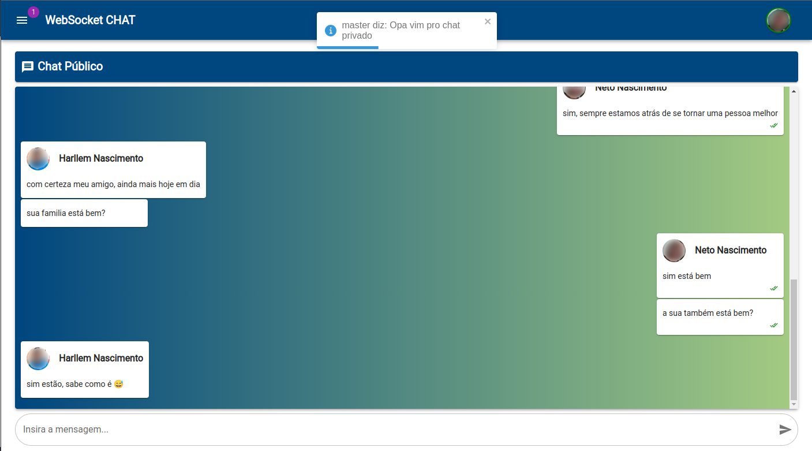
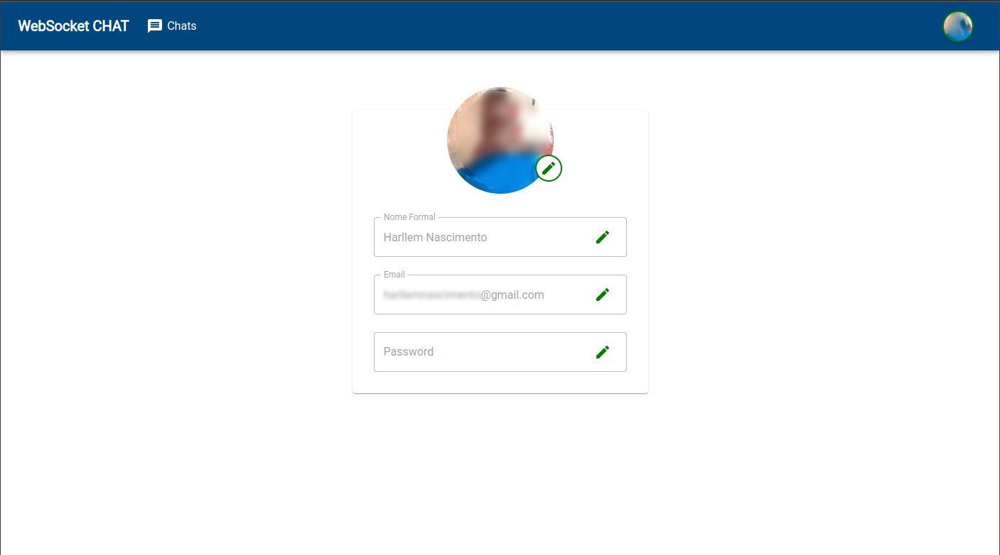
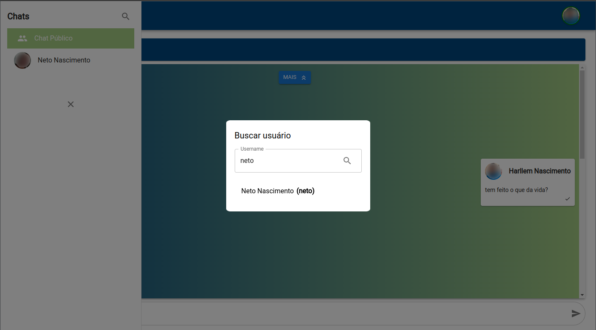

# RealTimeChat


O RealTimeChat é uma aplicação de chat em tempo real que consiste em um frontend em ReactJS, um backend em Spring Boot e um servidor proxy reverso Nginx. A aplicação permite que os usuários se cadastrem, façam login e conversem em salas de chat.

## Pré-requisitos

- Docker e Docker Compose instalados na máquina.

## Como executar a aplicação

1. Clone o repositório para sua máquina local:

```
git clone https://github.com/tiduswr/RealtimeCHAT.git
```

2. Navegue até o diretório do projeto:

```
cd RealTimeChat
```

3. Atualize o arquivo "MODELO - docker-compose.override.yml" renomeando para "docker-compose.override.yml" e preenchendo com os dados sensíveis da aplicação.

````
version: '3.7'

services:
  database:
    environment:
      - MYSQL_USER=seu_database_user
      - MYSQL_PASSWORD=seu_password
      - MYSQL_ROOT_PASSWORD=seu_database_root_password

  backend:
    environment:
      - DB_USERNAME=seu_database_user
      - DB_PASSWORD=seu_password
      - JWT_SECRET=sua_chave_jwt_secret
````

4. Construa e execute os contêineres Docker usando o Docker Compose:

```
docker-compose up -d
```

5. Aguarde até que todos os contêineres sejam inicializados corretamente. Após a conclusão, você poderá acessar o frontend em `http://localhost` e começar a usar a aplicação de chat em tempo real.

## Como fazer deploy via Kubernetes

1. Clone o repositório para sua máquina local:

```
git clone https://github.com/tiduswr/RealtimeCHAT.git
```

2. Navegue até o diretório do projeto:

```
cd RealTimeChat
```

3. Atualize o arquivo "secrets_MODELO.yaml" renomeando para "secrets.yaml" e preenchendo com os dados sensíveis da aplicação.

````
apiVersion: v1
kind: Secret
metadata:
  name: secrets
  namespace: webchat
type: Opaque
data:
  #Precisa estar em base64
  db-user: seu_database_user
  db-pass: seu_password
  db-root-pass: seu_database_root_password
  jwt-secret: sua_chave_jwt_secret
````

4. Construa na ordem abaixo os objetos:

```
$ kubectl create -f namespace/
$ kubectl create -f persistent_volume_claim/
$ kubectl create -f secrets/
$ kubectl create -f deployments/
$ kubectl create -f service/
```

5. Aguarde até que todos os contêineres sejam inicializados corretamente. Para verificar o status de cada um utilize

```
$ kubectl get pod -n webchat
$ kubectl logs <nome_do_pod> -n webchat
```

6. Para verificar o link de acesso a aplicação utilize:

```
$ minikube service webchat-proxy -n webchat
```

## Estrutura do projeto

- `backend`: Contém o código-fonte e os arquivos de configuração do backend Spring Boot.
- `frontend`: Contém o código-fonte e os arquivos de configuração do frontend ReactJS.
- `database`: Contém os arquivos de configuração e scripts para a inicialização do banco de dados MySQL.
- `proxy`: Contém os arquivos de configuração do servidor de roteamento de requisições usando NGINX.

## Screenshots







## Contribuição

Contribuições são bem-vindas! Se você encontrar algum problema ou tiver sugestões de melhorias, fique à vontade para abrir uma issue ou enviar um pull request.

## Licença

Este projeto está licenciado sob a [MIT License](LICENSE).